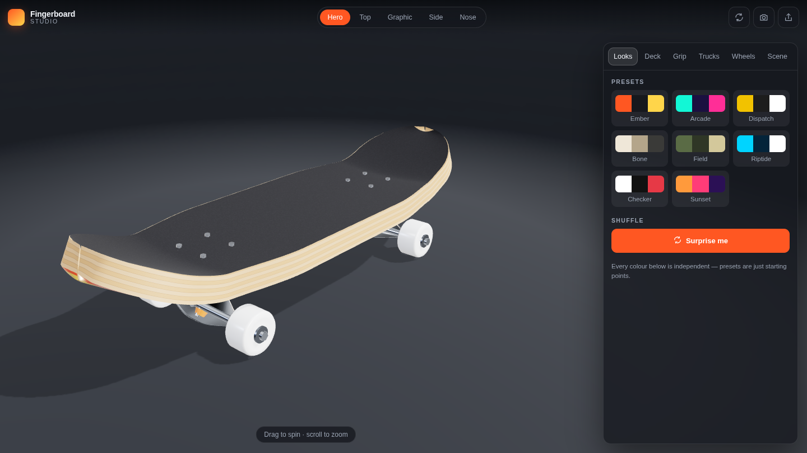

# Fingerboard Studio

An interactive 3D fingerboard you can spin, inspect and re-skin — in the browser,
on a laptop or a phone. Nothing to install to look at it, and no 3D assets to
download: the deck, trucks, wheels and every graphic are generated in code.



## What it does

- **A real board, modelled procedurally.** The deck is built from its actual
  profile — flat through the middle, kicked nose and tail, rolled concave across
  the width, a rounded nose in plan view and a seven-ply laminated edge. Trucks
  are a full assembly: baseplate, tapered hanger, axles, kingpin, bushings,
  pivot, washers, axle nuts and eight mounting bolts.
- **Spin it.** Drag to orbit, scroll or pinch to zoom, two fingers to pan. Five
  framed camera stops (Hero, Top, Graphic, Side, Nose) that re-fit themselves to
  whatever size window you are in.
- **Reshape it.** Deck length, width, concave, kick height and length, wheelbase,
  wheel size and ride height are all live sliders labelled in millimetres, plus
  five stock sizes. The deck is rebuilt from those numbers, so the graphic, grip
  and hardware follow the new shape.
- **Re-skin it.** Eight deck graphics, each driven by three colours you pick;
  grip tape colour and pattern; truck finish, tint and bushings; wheel style and
  urethane colour; hardware; veneer; lacquer gloss. Or upload your own image and
  it gets printed on the underside of the deck.
- **Built for a phone.** The customiser is a drag-up bottom sheet, the camera
  reframes around it so the board is never hidden behind the UI, and gestures,
  safe areas and orientation changes are all handled.
- **Share a build.** The Share button puts the whole configuration in the URL,
  so a link opens the exact same board on any other device.

## The game

**Skate it** in the top bar drops the board you just built into a 3D
fingerboard setup on a table in a bedroom, seen from behind in third person.
Roll anywhere:
air the quarter pipes, grind the rails and ledges, drop the stairs and find the
five letters S-K-A-T-E. Two-minute sessions; score as much as you can.

| | Keyboard | Phone |
|---|---|---|
| Push / brake | W / S (or ↑ / ↓) | auto-push on; left stick down to brake |
| Steer | A / D (or ← / →) | left stick left / right |
| Ollie | hold Space to crouch, let go to pop | hold **Ollie**, let go |
| Kickflip · Shuv · Heelflip · 360 flip | J · K · L · I | the trick buttons |
| Spin 180s and 360s | A / D in the air | left stick in the air |
| Pause | P or Esc | Pause |

- A trick pressed while rolling ollies and throws it in one go; pressed in the
  air it throws it mid-air. A flip and a shuv together make a varial.
- Land on a rail, a ledge edge or the coping with the board along it for a
  50-50, or turned across it for a boardslide (a lipslide on a ledge). Pop out
  of a grind any time; it hops you off to the low side.
- Ride straight up a quarter pipe and you launch vertically and come back down
  into it, riding away fakie. Carve along it for an air that travels.
- Walls are walls: glance off one and you deflect, ride into one square at
  speed and you slam. Land with the board sideways, mid-flip or straddling an
  edge and you bail.
- Every scoring landing or grind raises the multiplier; a bail resets it, and
  so do three seconds of just rolling.
- Ride off the edge of the table and you fall to the floor — then you are put
  back on near where you went over, facing in.
- Settings on the start and pause screens: **auto-push** (keep rolling without
  holding forward; on by default on phones), **spin assist** (let go mid-spin
  and it settles to the nearest clean 180) and, on phones that can,
  **vibration** on pops, landings, grinds and bails. They are remembered.

On phones the game is built to hold its frame rate rather than look its best:
it starts at a moderate resolution, and if the typical frame takes longer
than 25ms it steps down — resolution, then shadow detail, then the tilt-shift
blur, then shadows — within a couple of seconds. Touch controls appear on any
touch-first device (not only ones that report a coarse pointer), page
scrolling and zooming are blocked while you play, the game pauses when the
app is put away or the GPU context is lost, and every trip into the park
releases its GL context on the way out, so going back and forth to the garage
never runs a phone out of them.

It is also built to be cheap to draw. Everything that never moves — the
room, the table, every obstacle — is merged into one mesh per material, and
plain-coloured materials share one material with the colour moved into the
vertices; the board's forty-odd parts are merged the same way. A frame is
about 35 draw calls, down from about 165. The obstacles' shadows on the table
are baked once at load, by marching rays through the park's own heights
(`bakedShadows.js`), so the live shadow map only ever draws the board. The
room is Lambert-shaded (it is always behind the blur), shader compile logs
are not read back in production, and shaders are warmed up while the start
screen is showing where the GPU can compile in parallel.

Landings are scored for what you did with them, and the noise matches: a comic
starburst for an ordinary one, and for anything really good a full-panel
flourish with radiating speed lines, a dip into slow motion and a camera lean.
Flips draw a trail off the nose of the board, grinds throw sparks back along
the rail, and every landing kicks up an impact ring.

The setup is what someone would actually put on their table: store-bought
style fingerboard obstacles — a row of plywood quarter-pipe modules with
steel coping and screwed-down decks at each end, a plywood funbox, two
kickers, a black-painted ledge with steel edges, a flat bar, a concrete-look
manual pad, a platform with a bank and a stair set with a red handrail — and
whatever else lives on the table, all of it solid and some of it skateable:
a closed laptop (a very good manual pad), a stack of three hardbacks, a
300mm ruler bridged across two erasers (the classic homemade ledge), a phone
lying face down, a mug, a pencil pot and a desk lamp that is switched on.
Flat things — a sketch of the next ramp, sticky notes, some change, the little
screwdriver — lie in the corners.

Round it is a bedroom: an oak table on legs, a rug, floorboards, a window
onto rooftops and sky with curtains and a plant on the sill, a radiator, a
bookshelf, a bed, posters, a door, a desk chair and a real skateboard leaning
on the wall.

The light is a low afternoon sun through that window (`lighting.js`). Its
shadow map covers the whole room but is drawn once, at load — the walls,
window and obstacles never move — so the window throws a real patch of
sunlight across the table with the glazing bars' shadows in it, obstacles
shade each other and the table, and the far corners fall into shade, for no
cost per frame. The board's own shadow is projected along the sunlight onto
whatever is below it, crisp in the sun and a faint smudge in the shade, and
the board darkens when you ride out of the light. The room is photographed
once from over the table and used as the environment, so the coping, rails,
trucks, laptop, mug and the satin-lacquered table reflect this window and
these walls, and the ambient light carries the room's own colours. Wood grain,
ply and concrete are raised as bump from their own colour maps. Dust drifts in
the sunlight, the window glows (on desktop, where the frame is HDR), and a
neutral tone curve keeps colours true while rolling off the highlights. Phones
get the same sun, shadows and reflections on the obstacles, with a cheaper
room and no glow.

Scale is the point. The deck is 96mm, the quarter pipes are 90mm tall, the
table is 2.6m x 1.7m and 750mm off the floor, the mug is 95mm — real sizes,
so the board reads as tiny against things you already know the size of. A
tilt-shift pass keeps a band in focus and softens the rest, which is what a
macro lens does to something this small, and it tracks the board.

## Marble race

**Marble race** in the garage's top bar opens a second game. Pick one of 24
marbles — Ruby, Chrome, Galaxy, Lava, Earth, an eight-ball and the rest — and
watch all 24 race down a marble run generated fresh for that race. The camera
follows yours (or the leader, or the whole run), a live leaderboard shows the
order, and the results end on a podium.

Every run is a new layout (`src/marbles/track.js`), stitched from modules:
banked curves, a spiral, a pachinko-style peg field, pop bumpers that kick,
a spinning paddle, a funnel, rolling waves, a split into two lanes, boost pads,
a steep plunge, then the finish line and a catch basin. The generator rejects
any layout that passes through itself, and any where some line down the chute
— either edge or the middle — rises anywhere, because a rise is exactly a
pocket a marble can come to rest in.

The marbles really roll (`src/marbles/physics.js`): spheres against the run's
own triangles through a spatial hash, against each other, against pegs,
bumpers and the spinner, with gravity, a little rolling resistance and air
drag, stepped at 200Hz so nothing tunnels. A marble that jumps the run is put
back on it a little way behind.

If anything is still on the run 30 seconds after the winner finishes, a wall
of fire comes down the run from the start and burns whatever it catches, which
ends the race. It is meant to be rare, and it is: across 40 simulated races
(`npm run sim:marbles`) every marble but one rolled home on its own, and the
fire was needed in one race. The test also pins a marble in place to check the
fire does come for it and the race does end.

## Trying it on your phone

### Right now, no setup — over your Wi-Fi

```bash
npm install
npm run dev:lan
```

Vite prints a **Network:** address such as `http://192.168.1.24:5173/`. Type that
into your phone's browser while it is on the same network. `npm run preview`
serves a production build the same way. This needs nothing configured on GitHub.

### A permanent link — GitHub Pages

`.github/workflows/deploy.yml` builds and publishes the site on every push, but
it needs two one-time clicks that only a repo owner can do — the Actions token
is not permitted to make them:

1. **Settings → Pages → Source: GitHub Actions.** Until this is set, the deploy
   job fails with *"Get Pages site failed."*
2. **Get this branch onto the default branch.** GitHub only allows Pages
   deployments from the default branch by default, and this repo's default is
   currently `claude/marketing-posts-x-6hfk7p`. Either merge
   `claude/fingerboard-3d-viewer-s77665` into the default branch, make it the
   default (Settings → Branches), or add it under
   Settings → Environments → `github-pages` → Deployment branches.

Then re-run the workflow from the Actions tab. The site lands at
`https://cloudkingtv.github.io/3D-model/`.

## Running it locally

```bash
npm install
npm run dev             # dev server at http://localhost:5173
npm run build           # production build into dist/
npm run preview         # serve the built site
npm run build:artifact  # repackage the build as a Claude Artifact page
npm test                # effects checks, the park simulation, 16 marble races
npm run sim             # just the park simulation (SEEDS=20 for a longer soak)
npm run sim:marbles     # 40 simulated marble races, with the fire-wall stats
```

Requires Node 20+. The only runtime dependency is [three.js](https://threejs.org).

`build:artifact` writes `dist/artifact.html` — the same app with the document
skeleton stripped, for hosts that supply their own. Publish it together with the
two files in `dist/assets/` that it names.

The app adapts to being embedded in a frame: breakpoints follow its own width
rather than the viewport's, and the Share button hides itself, because a
cross-origin frame does not pass the URL hash its links depend on.

## How it is put together

```
index.html           markup shell — canvas, top bar, panel
src/main.js          wiring: store <-> viewer <-> UI, sheet drag, share, snapshot
src/styles.css       the whole UI, responsive down to small phones
src/lib/geometry.js  deck surface maths, truck sweeps, wheel lathe
src/lib/fingerboard.js  assembles the board and owns every material
src/lib/textures.js  canvas-drawn graphics: skins, grip, ply, wheels, backdrops
src/lib/viewer.js    renderer, lighting, orbit controls, camera framing
src/lib/state.js     config store, presets, localStorage and share links
src/ui/controls.js   small DOM builders (swatches, sliders, toggles, tiles)
src/ui/panel.js      the customiser tabs
src/ui/gameHud.js    score, timer, combo, letters and the game overlays
src/ui/touchControls.js  the phone stick, ollie and trick buttons
src/lib/device.js    is this a touch-first device
src/game/park.js     the course: obstacle layout, heights, grind lines (pure)
src/game/settings.js auto-push, spin assist, vibration; remembered
src/game/rider.js    3D board physics, tricks, grinds and scoring (pure)
src/game/props.js    the obstacle kit and table objects, built from park.js
src/game/room.js     the bedroom and the table
src/game/batch.js    merges static meshes into one per material
src/game/lighting.js the sun, its one-off shadow map, the board's shadow,
                     dust in the sunlight, the captured environment
src/game/bakedShadows.js  contact darkening on the table, baked at load
src/game/canvasKit.js     canvas textures and small mesh helpers
src/game/scene.js    game scene, lighting, board pose, third-person camera
src/game/tiltshift.js the miniature-faking blur
src/game/effects.js  sparks, flip trails, impact rings, screen shake
src/game/comic.js    comic starbursts and the big-landing flourish
src/game/index.js    game loop, input and run lifecycle
src/marbles/track.js    marble run generator: path, triangles, obstacles (pure)
src/marbles/physics.js  marble physics, placings, respawns, the fire wall (pure)
src/marbles/designs.js  the 24 marbles, drawn on canvases
src/marbles/scene.js    sky, the run, obstacles, marbles, fire, race camera
src/marbles/index.js    picker → countdown → race → results
src/ui/marbleHud.js     picker, leaderboard, fire warnings, podium
test/effects.test.mjs  effects geometry and lifetimes, headless
test/marbles.sim.mjs   whole races on generated tracks: finish rates, fire
                       wall use, and a stuck marble the fire must clear
test/park.sim.mjs      scripted lines round the park, plus random sessions
                       checked every step for any part of the board inside
                       anything
```

Details worth knowing if you want to extend it:

- **The park is one description.** Each obstacle in `LAYOUT` (`park.js`) is a
  box, wedge, quarter pipe, stairs, rail or cylinder with its own position,
  turn and `look` (plywood, laptop, books, mug…), and
  `heightAt(x, z)` answers from exactly the same profile functions that
  `props.js` samples to build the meshes. What you see is what the board rides.
- **Collision** treats the board as a rigid plank with contact points across
  its wheels, trucks, belly, nose and tail — spaced tighter than a rail is
  wide. It rests on the upper hull of those points over its middle, so it sits
  on its wheels on flat, spans a transition, balances on its belly over a lip
  and stays level with its front wheels past an edge until the middle goes
  over. A face is anything that rises faster than a slope can between samples
  0.2 apart; faces are walls, found by sweeping every contact point along the
  path each step, turns included. In the air the board is tested exactly as
  posed, so it cannot tilt itself round an edge it is about to hit.
  `npm test` rides scripted lines and 12 random 90-second sessions across
  three board shapes and fails if any step has part of the board inside
  anything.
- **Deck geometry** is a parametric surface. `deckKick(x, spec)` gives the
  centre-line height and `deckHalfWidth(x, spec)` the outline; the solid is that
  surface plus a copy offset along its own normal, so the deck keeps a constant
  thickness through the kicks. `resolveShape()` turns the handful of numbers the
  Shape tab edits into the full spec every builder reads, including the derived
  ones (where the nose arc starts, how far the axles reach, ride height).
- **Reshaping rebuilds the meshes but not the materials**, so skins survive it.
  A slider drag rebuilds at reduced tessellation, at most once per frame, and
  restores full detail when the handle is released.
- **Adding a skin** means adding one `draw(ctx, w, h, palette)` function to
  `DECK_SKINS` in `src/lib/textures.js`. It receives a canvas sized to the deck's
  aspect ratio and the user's three colours; everything else is automatic.
